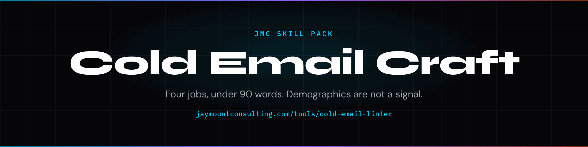

<p align="center">
  
</p>

# Cold email skill for Claude Code

A cold email is a short note to someone who has not asked to hear from you, anchored to a public signal.

> "VP of Marketing at Series B" is not a reason to write. A job post four days ago is.

A JMC cold email is four jobs in under 90 words: a verbatim public signal, the pain that signal implies, a 22-word EVP, and a binary ask. Demographics are not a signal.

You have seen the other kind. Hope you're well. Just bumping this. Let me know if you'd like to learn more. That email is a search query wearing a name. This pack will not write it.

The mechanism is Signal → Pain → EVP → Ask. Every line has to do one of those four jobs. If it does not, it gets cut. The linter is Python, not a vibe: spam lexicon, ALL CAPS, emoji, fake threading, link pile-ups.

The sample T1 in `examples/t1.email.md` lints at **100**. `URGENT! ACT NOW 🚀 FREE` is rejected. No LLM. No paid API.

The build guide teaches the framework to a human. This pack teaches the same framework to an agent.

[](https://claude.ai/claude-code)
[](LICENSE)
[](https://github.com/cmj-hub/claude-cold-email)
[](https://skills.sh/cmj-hub/claude-cold-email)


<p align="center">
  
</p>

## What this replaces

The drafting stack an $80K SDR owns on a slow week — not the send, not the domain warm, not the close. Framework plus ~$130/mo in sending tools is the rest of the motion you already have.

## Install

Two commands. Works in Claude Code, Cursor, Codex, Grok, Copilot, Windsurf, Cline, OpenCode, and the rest of the [skills CLI](https://skills.sh) list.

```bash
npx skills add cmj-hub/claude-cold-email --all -g --full-depth
```

```text
/plugin marketplace add cmj-hub/gtm-operator-skills
/plugin install cold-email
```

Also: `npm install github:cmj-hub/claude-cold-email` then `npx jmc-cold-email`. Or `curl -fsSL https://raw.githubusercontent.com/cmj-hub/claude-cold-email/main/install.sh | bash`.

## What you walk out with in 15 minutes

Artifact: `examples/t1.email.md`.

```bash
python3 scripts/spam_word_lint.py \
  --subject "Pipeline gap after the Q3 hire freeze?" \
  --body "Sarah — saw you posted the Demand Gen Lead role four days ago. Pipeline gap is usually upstream of an SDR hire. Worth 15 min Thursday to walk through?"
python3 scripts/score_subject_line.py --subject "Pipeline gap after the Q3 freeze?" --framework pain
```

One T1. Lint it. Then write yours against the same four jobs.

## What this pack will not do

It will not send the email. It will not ingest your CRM. It will not warm a domain.

This pack drafts and scores. It will not pick this quarter's PSP, ingest your CRM, or update when Gmail changes the spam window. Those are judgement calls and live data. This pack gives you the instrument and the rubric; you bring the account.

## Does this send the email for me?

No. It drafts and lints. You send — or your sequencer does. Live send, reply write-back, and CRM ingest are out of scope for a skill pack: they need credentials this repo will never ask for.

## What is a binary CTA?

A yes/no ask. "Worth 15 minutes Thursday?" is binary. "Let me know if you'd like to learn more" is not. One ask per email. Stacked asks confuse the person who has to answer at 11am.

## Will this get me marked as spam?

The linter catches the word list, ALL CAPS, emoji, fake threading, and link pile-ups. It does not promise inbox. It does not set SPF, DKIM, or DMARC. DNS scoring is in the pack. Running your infra is not.

## On the site

- [Cold Email pack](https://jaymountconsulting.com/skills/claude-cold-email) — this pack's page
- [Skill packs catalog](https://jaymountconsulting.com/skills) — install paths + every pack
- [Course twin](https://jaymountconsulting.com/learn/courses/cold-email-outreach-craft) — human build guide for this pack

## Free, no signup

- **[Cold Email Linter](https://jaymountconsulting.com/tools/cold-email-linter)** — the same job as this pack, hosted. No account, no key.
- [Cold Email & Outreach Craft framework](https://jaymountconsulting.com/frameworks/cold-email-outreach-craft)
- [Prompt Library](https://jaymountconsulting.com/resources/prompt-library)

## Free, by email

[**Growth Audit**](https://jaymountconsulting.com/growth-audit) — where your go-to-market stack is leaking, sent to your inbox.

That one does ask for an email, and it enrols you in a short follow-up on the same topic. Unsubscribe whenever.

[**The Friday Signal**](https://jaymountconsulting.com/newsletter/signal) — one free edition a week on building GTM systems that compound. No pitch in it.


## Companion packs

- [claude-psp](https://github.com/cmj-hub/claude-psp) — Ideal customer profile
- [claude-evp](https://github.com/cmj-hub/claude-evp) — Value proposition
- [claude-founder-brand](https://github.com/cmj-hub/claude-founder-brand) — LinkedIn posts
- [claude-pricing](https://github.com/cmj-hub/claude-pricing) — Pricing strategy
- [claude-landing-page](https://github.com/cmj-hub/claude-landing-page) — Landing page
- [claude-geo](https://github.com/cmj-hub/claude-geo) — Generative engine optimization
- [claude-sales-offer](https://github.com/cmj-hub/claude-sales-offer) — Sales offer
- [claude-prospect-list](https://github.com/cmj-hub/claude-prospect-list) — Sales prospecting
- [claude-email-sequence](https://github.com/cmj-hub/claude-email-sequence) — Email sequence

## License

MIT. See [LICENSE](./LICENSE).

## About

Built by [Jay Mount Consulting](https://jaymountconsulting.com).

## Regenerating the artwork

`assets/social-preview.png` and `assets/header.png` are generated from `assets/spec.json` by a vendored renderer — no CI, no shared workflow, no network beyond the webfonts:

```bash
node assets/card.mjs assets/spec.json assets/          # social-preview.png + header.png
npm i playwright-core && node assets/demo.mjs assets/spec.json assets/demo.gif
```
