<p align="center">
  
</p>

# claude-cold-email

> Replace an $80K SDR with the JMC framework + ~$130/mo in tools.
> Cold email & outreach craft for B2B founders, as a Claude Code skill pack.

The full **JMC Cold Email & Outreach Craft course** as a skill pack —
11 sub-skills, 2 specialist agents, 5 deterministic Python/Bash
scripts, brand-config-driven so it sounds like *you*, not Jay, not
ChatGPT.

No LLM calls inside the skill itself. No paid APIs. No vendor
lock-in. Bring your own model; bring your own sending stack.

[](LICENSE)
[](https://github.com/cmj-hub/claude-cold-email)


<p align="center">
  
</p>

## What it does

```mermaid
graph TB
    A["/cold-email"] --> B{Kickoff: state check}
    B -->|First time| C[Onboarding<br/>brand-config + SOUL]
    B -->|Have config| D[Craft / Audit / Nurture]
    C --> D
    D --> E[Spam Lint<br/>script]
    E --> F[Send infrastructure]
    F --> G[Reply Scoring<br/>script]
    G --> H[Weekly Rhythm<br/>Mon/Wed/Fri]
    H --> D

    style C fill:#1a1a2e,stroke:#00d4ff
    style E fill:#1a1a2e,stroke:#cc4714
    style G fill:#1a1a2e,stroke:#cc4714
    style H fill:#1a1a2e,stroke:#00d4ff
```



## The 11 sub-skills

| Sub-skill | What it does |
|---|---|
| `cold-email-kickoff` | Adaptive router. Detects what's set up (brand-config? PSP? EVP? infra?) and picks the next-best step |
| `cold-email-onboarding` | 10-minute interactive setup → `brand-config.json` + `SOUL.md` at repo root |
| `cold-email-craft` | Draft a single signal-anchored email or a 3-touch sequence — using YOUR brand + voice |
| `cold-email-audit` | 30-point outbound program audit (infra / targeting / messaging / ops) → 0-100 score + top 3 levers + 90-day remediation order |
| `cold-email-nurture` | 5-email nurture stream with route-to-sales triggers |
| `cold-email-deliverability` | 15-point pre-campaign domain health (SPF, DKIM, DMARC, blacklists, warm-up, content) |
| `cold-email-subject-lines` | Generate or critique subject lines across 4 framework families (pain, curiosity, social-proof, direct) |
| `cold-email-spam-lint` | Deterministic spam-trigger scan — 200+ word lexicon, Python-backed, <100ms per email |
| `cold-email-reply-scoring` | Classify replies into buy-signal / positive / neutral / not-interested. Script-backed (no LLM, no per-reply cost) |
| `cold-email-list-quality` | 6-axis list scoring (dedup, role-fit, signal freshness, email validity, exclusion match, company-stage match) |
| `cold-email-weekly-rhythm` | Operational cadence — Mon (signals + list), Wed (ship + triage), Fri (score + adjust) |

Plus 2 specialist agents:

- `cold-email-reviewer` — scores any draft 0-100 with line-by-line critique
- `cold-email-deliverability-auditor` — DNS + reputation + bulk-sender compliance

## Real scripts, not pure vibes

| Script | Job |
|---|---|
| `scripts/spam_word_lint.py` | Spam-trigger scanner — 200+ lexicon + clickbait + ALL CAPS + emoji + fake-threading + link/image ratio. 0-100 risk score |
| `scripts/score_subject_line.py` | Subject scoring — 5 axes (length, spam, clickbait, personalization, framework-fit) |
| `scripts/score_reply.py` | Reply classifier — 5 categories (buy-signal / positive / neutral / not-interested / auto-reply) via regex + feature engineering |
| `scripts/dig_dns.sh` | DNS lookups — SPF, DKIM, DMARC, MX, reverse DNS |
| `scripts/check_deliverability.py` | Deliverability scorer — 15 checks → 0-100 → fix order. No paid APIs. |

Each script is **zero-dependency Python 3.8+ or POSIX bash**. No `pip
install`, no API keys, no network calls except DNS + (optional) public
blacklist URLs. Calibrated against JMC's review of 1,000+ real B2B
campaigns.

## The 3-tier config (operator owns)

```
brand-config.json   ← Your ICP, PSP, EVP, tone, infrastructure, ops cadence
SOUL.md             ← Your voice — phrases used, phrases banned, stories you lean on
AGENTS.md           ← Behavior rules — generally "don't fabricate, don't send without auth, refuse banned patterns"
```

The JMC framework is the engine. These three files personalize every
output. **The skill refuses to draft real outreach without
brand-config + SOUL set up** — generic AI cold email is worse than no
cold email.

## Install

### Claude Code

```bash
/plugin marketplace add cmj-hub/claude-cold-email
/plugin install cold-email
```

### One-line install (any project)

```bash
curl -fsSL https://raw.githubusercontent.com/cmj-hub/claude-cold-email/main/install.sh | bash
```

### Windows

```powershell
iwr https://raw.githubusercontent.com/cmj-hub/claude-cold-email/main/install.ps1 -useb | iex
```

## First run

```
> /cold-email
```

The kickoff sub-skill detects state. If you're new:

```
[Detected state: brand-config.json missing]

You're at step 1 of 7. The 7 steps:
1. ⬜ Set up brand-config + voice (10 min)        ← YOU ARE HERE
2. ⬜ Build a Pain Signal Profile (20-30 min)
3. ⬜ Lock the EVP for your primary tier (15 min)
4. ⬜ Set up sending infrastructure
5. ⬜ Run the 15-point pre-campaign deliverability check
6. ⬜ Draft + ship first signal-anchored sequence
7. ⬜ Score replies + iterate (weekly rhythm)

Step 1 takes ~10 minutes and is required for everything else.

Want to run it now? (y/n)
```

## Cost arbitrage — what this actually replaces

| Role | $/year | What you'd outsource |
|---|---|---|
| SDR (entry-level) | $80K + benefits | List building, sequence shipping, reply triage |
| Cold-email agency (mid) | $60K-$120K/year | Strategy + execution outsourced |
| Cold-email vendor stack (Smartlead Pro, Clay, Apollo, Prospeo, etc.) | ~$130/mo | The tooling layer |

This skill pack + the JMC framework + ~$130/mo in vendor tooling can
do the strategy, list scoring, audit, drafting, deliverability, reply
triage, and weekly cadence that an SDR or agency would otherwise own.

It does **not** replace:
- The judgment calls (which PSP is right for this quarter?)
- The closing motion (the skill writes; sales closes)
- The relationship work (introductions, board referrals)

It **does** replace:
- The execution layer (the SDR's day-to-day)
- The QA layer (audits + lint + scoring)
- The cadence (operational rhythm without a project manager)

## What's actually inside the framework

```
Signal  →  Pain  →  EVP  →  Ask
  ↓         ↓       ↓       ↓
 What     What     What     What
 they      that    you do   you want
 just     means    about    them to
 did                it       do next
```

Every line of every email this skill produces serves one of those
four jobs. If it doesn't, the skill cuts it. The full framework lives
in [`cold-email/references/jmc-framework.md`](./cold-email/references/jmc-framework.md).

## Banned patterns

The skill refuses to produce these — pushes back with the JMC-shaped
alternative. Full list at
[`cold-email/references/banned-patterns.md`](./cold-email/references/banned-patterns.md):

- "Hope you're well" / "Hope this finds you well"
- "Just bumping this" / "Following up on my last email"
- "Let me know your thoughts" / "Happy to chat whenever"
- "Quick question" as an opener
- Multi-paragraph value-prop monologues
- Stacked questions
- Demographics-as-signal

## Plugs into

Companion skill packs (install separately):

- [`cmj-hub/claude-psp`](https://github.com/cmj-hub/claude-psp) — Pain Signal Profile builder
- [`cmj-hub/claude-evp`](https://github.com/cmj-hub/claude-evp) — EVP Generator (Schwartz tiers)
- [`cmj-hub/claude-founder-brand`](https://github.com/cmj-hub/claude-founder-brand) — Founder-led social
- [`cmj-hub/claude-operator-pass`](https://github.com/cmj-hub/claude-operator-pass) — Operator Pass API wrapper (the deterministic execution layer)

## Repo structure

```
claude-cold-email/
├── .claude-plugin/plugin.json
├── README.md
├── LICENSE
├── CHANGELOG.md
├── AGENTS.md                          ← Behavior rules
├── SOUL.md                            ← Voice template (operator personalizes)
├── brand-config.example.json          ← Brand config template
├── install.sh
├── install.ps1
├── cold-email/                        ← Main orchestrator
│   ├── SKILL.md
│   └── references/
│       ├── jmc-framework.md
│       ├── banned-patterns.md
│       └── binary-ctas.md
├── skills/                            ← 11 sub-skills (progressive disclosure)
│   ├── cold-email-onboarding/
│   ├── cold-email-kickoff/
│   ├── cold-email-craft/
│   ├── cold-email-audit/
│   ├── cold-email-nurture/
│   ├── cold-email-deliverability/
│   ├── cold-email-subject-lines/
│   ├── cold-email-spam-lint/
│   ├── cold-email-reply-scoring/
│   ├── cold-email-list-quality/
│   └── cold-email-weekly-rhythm/
├── agents/                            ← 2 specialist agents
│   ├── cold-email-reviewer.md
│   └── cold-email-deliverability-auditor.md
└── scripts/                           ← Deterministic Python/Bash (no LLM)
    ├── spam_word_lint.py
    ├── score_subject_line.py
    ├── score_reply.py
    ├── dig_dns.sh
    └── check_deliverability.py
```

## Course

This skill is the agent-form of the JMC **Cold Email & Outreach Craft**
course. The course covers PSPs in depth, infrastructure architecture,
sequence design at scale, deliverability forensics, and program
economics — across 26 lessons.

→ **[jaymountconsulting.com/learn/courses/cold-email-outreach-craft](https://jaymountconsulting.com/learn/courses/cold-email-outreach-craft)**

Want it all-access? **[Operator Pass](https://jaymountconsulting.com/operator-pass)**
unlocks every course in The Compounding Engine plus the deterministic
tools API. Founder pricing: $2,400/yr locked through July 16 2026
(100 seats).

## License

MIT. See [LICENSE](./LICENSE).

## About

Built by [Jay Mount Consulting](https://jaymountconsulting.com) as
part of the JMC public-build spine. See
[/build](https://jaymountconsulting.com/build) for what's shipping
this week, [/skills](https://jaymountconsulting.com/skills) for the
rest of the skill packs.
